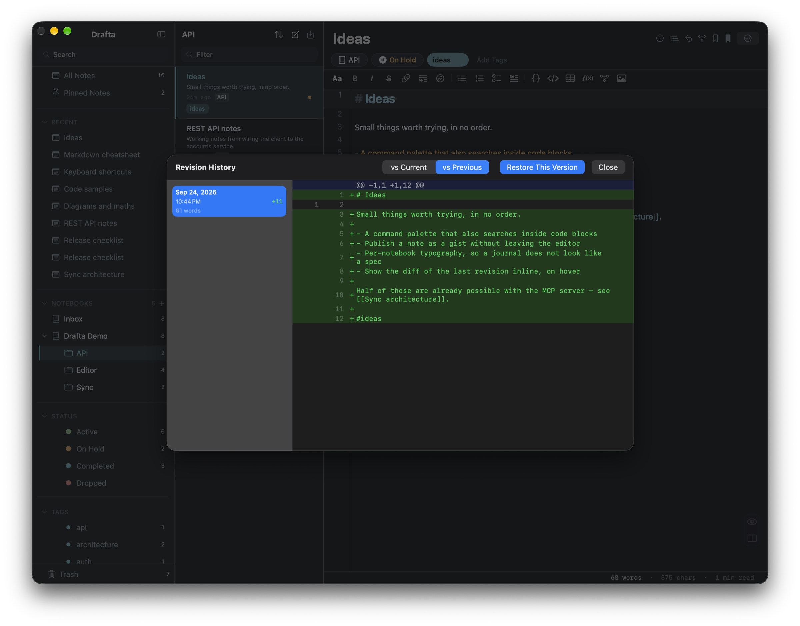

Notes change, and sometimes yesterday's version is better than today's. In Drafta, there are two mechanisms for this: revision history for each note and backups of the entire library. Both work locally, on your Mac. I wrote about how the notes themselves are stored in the article Заметки — это файлы: блокноты, теги, статусы и связи.

## Revisions: up to 30 per note

Drafta saves previous versions of a note to the `revisions` folder next to the notes. By default, up to 30 revisions are stored per note.

A revision is also saved when the note is rewritten by something other than a human. If an AI agent replaces the text of a note via the MCP server, the previous text remains as a revision. The agent can be allowed to write to the library without fear for the original text.

## History window

History opens via the Revision History item in the note menu or in the context menu of the list. On the left is the list of revisions: date, time, how many lines were added, and how many words were in the version. On the right is a unified diff.

The diff is built in two modes:

- **vs Current** — the selected revision against the current text;
- **vs Previous** — the selected revision against the previous one.

The Restore This Version button returns the selected version to the note.

*Note history: revision on the left, diff against the previous version on the right, Restore This Version button at the top.*

> [!TIP]
> The vs Previous mode is convenient for understanding exactly what changed in a particular edit. The vs Current mode is for deciding whether the version is worth restoring.

## How much to keep

The revision limit is configured in the General section: from 10 to 200 per note. There, too, are the auto-cleanup period for the trash and the number of recent notes in the sidebar.

*General: 30 revisions per note, 10 recent notes, trash kept forever.*

The General section also sets startup behavior: open the last note, create a new one, or show the list.

## Library backups

Revisions protect an individual note. A backup protects the entire library at once: Drafta packs it into a ZIP archive with a name like `Drafta-Library-Backup-<дата>.zip` and places it in the `Backups` folder next to the library.

The Storage section of the settings manages automatic copies:

| Setting | Values |
|---|---|
| Automatic Backup | Off, Daily, Weekly, Monthly |
| Keep N backups | from 1 to 30 archives |

When the number of archives exceeds the limit, the oldest ones are deleted. The section shows when the last copy was made and when the next one will be. The Backup Now button makes a copy immediately, and Reveal Backups in Finder opens the folder with the archives.

*Storage: weekly backup, 7 archives, Backup Now and Reveal Backups in Finder buttons.*

You can also make a copy manually, to any location on disk: the Backup Library Now… item in the file menu.

## Three layers of protection

Together, this gives three independent layers:

1. **Revisions** — rolling back a single note to one of the recent versions.
2. **Backups** — an archive of the entire library on a schedule.
3. **Sync** — an encrypted copy outside your Mac.

On top of this, the notes themselves are ordinary Markdown files. They can be put in git and get a fourth layer that Drafta does not control at all.

The next article is about the third layer, sync and encryption.
