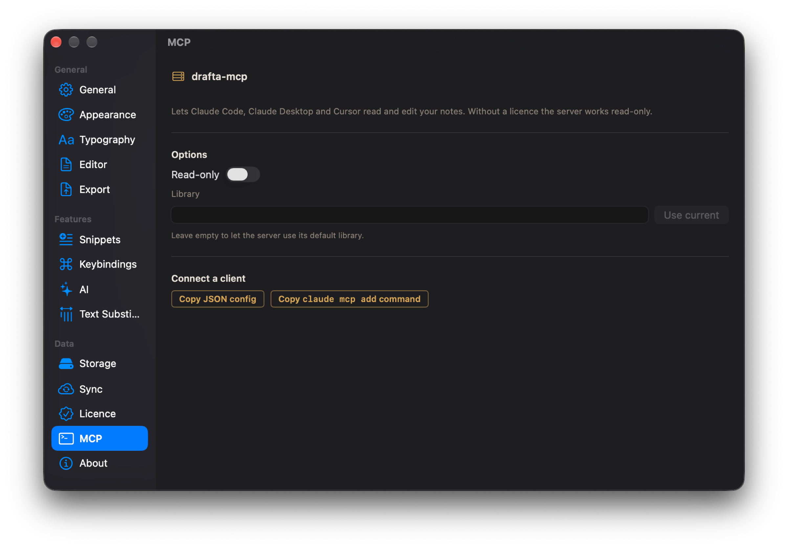

The ⌘J assistant works with one open note — that's what article AI-ассистент в Drafta: ⌘J и ваш ключ is about. But an agent that writes code with me needs the whole library: find a note about the architecture, append a solution to it, create a new one for a bug. That's why Drafta has a built-in MCP server.

## What the Drafta MCP server is

MCP is a protocol through which AI clients call external tools. The server `drafta-mcp` lives inside the app itself, in `Drafta.app/Contents/Helpers`. There's nothing to install separately.

The server gives Claude Code, Claude Desktop, Cursor, and other MCP clients access to your notes. It works with the same library of Markdown files as the app.

## 12 tools

Five tools read:

| Tool | What it does |
|---|---|
| `search_notes` | searches notes by text, tag, notebook, and status |
| `read_note` | reads a note in full |
| `list_notebooks` | shows notebooks |
| `list_tags` | shows tags |
| `formatting_guide` | explains to the agent which Markdown Drafta understands |

Seven tools write:

| Tool | What it does |
|---|---|
| `create_note` | creates a note |
| `append_to_note` | appends to a note |
| `update_note` | rewrites a note |
| `set_note_status` | changes the status |
| `tag_note` | sets a tag |
| `create_notebook` | creates a notebook |
| `trash_note` | sends a note to the trash |

There is no tool that deletes a note permanently. `trash_note` puts it in the trash, from where it can be recovered.

## A revision for every rewrite

When the agent rewrites a note via `update_note`, the previous text is saved as a revision. It can be seen in the history window, and it can be restored with one button. More on this — in article История ревизий и резервные копии.

`formatting_guide` is needed so the agent writes notes the way Drafta renders them: with callouts, Mermaid diagrams, formulas, tasks, and wiki links. Without it, the agent writes plain text.

## How to connect

There's an MCP section in the settings. It has two buttons:

1. **Copy JSON config** copies a ready-made configuration for a client that needs JSON.
2. **Copy claude mcp add command** copies the command for Claude Code.

You paste the configuration or command into your client — and the agent sees the library.

*The MCP section: read-only mode, the library path, and two buttons for connecting a client.*

The Library field sets which library the server works with. If you leave it empty, the server uses the default library. The Use current button inserts the one that's open in the app.

## Read-only mode

Sometimes it's enough for the agent to look. For that there's the Read-only toggle: in this mode the write tools disappear, and the agent can only search and read.

> [!NOTE]
> Without a valid license, the server works read-only, even if the Read-only toggle is off. After the trial without a plan, the agent can still search and read notes.

## How I use it

My project documentation lives in Drafta: architecture, checklists, decisions. In Claude Code, the agent searches for the needed note via `search_notes` before work, and after work appends the result via `append_to_note`. It changes the task status via `set_note_status`, rather than writing "done" in the text.

This series of articles also went through the MCP server: the agent created notes in the blog notebook, and publishing to the site was triggered by the Completed status.

The last article in the series is about what Drafta looks like: themes, typography, and export profiles.
