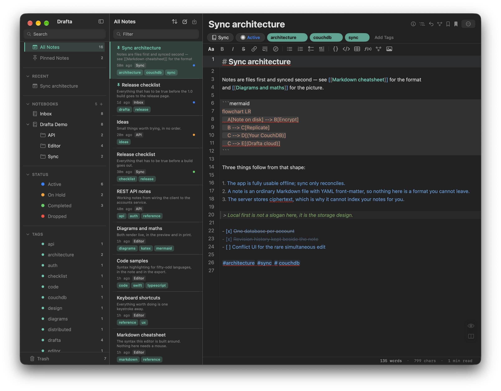
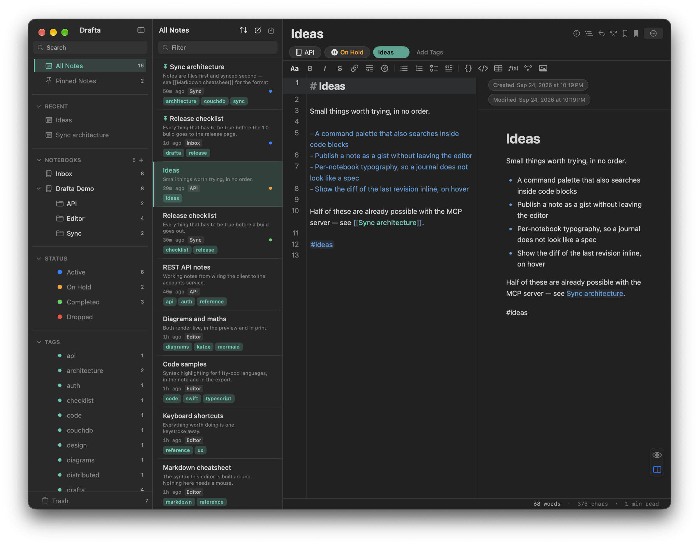
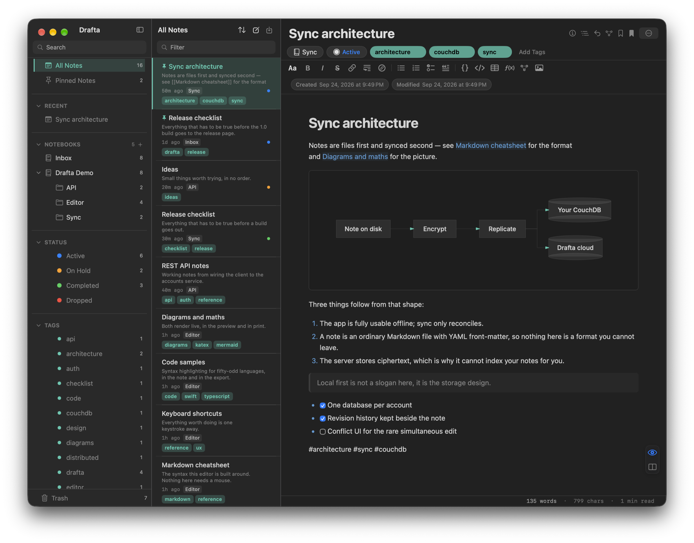
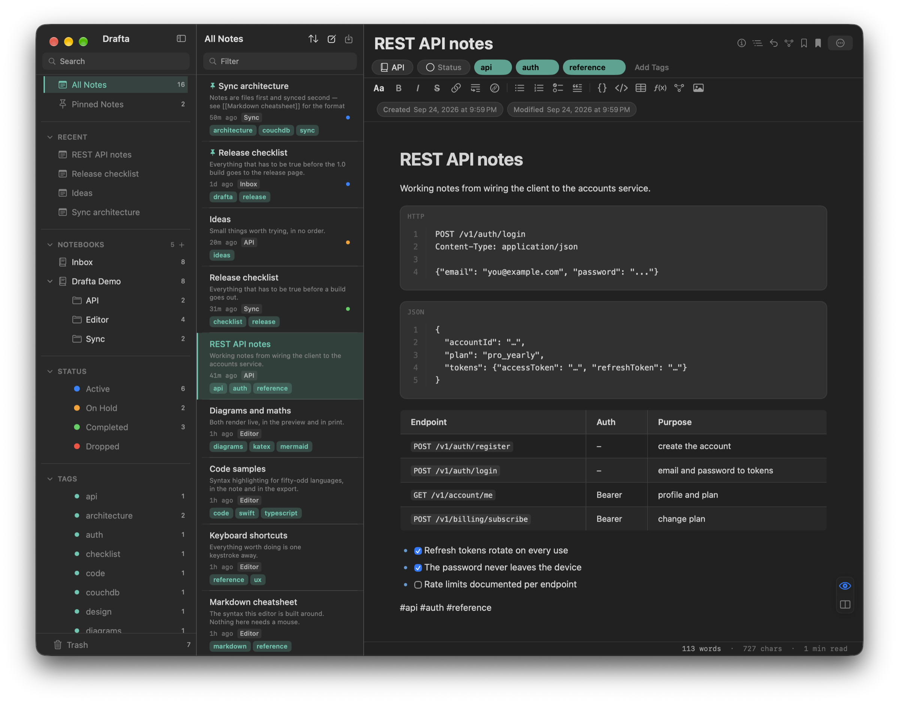
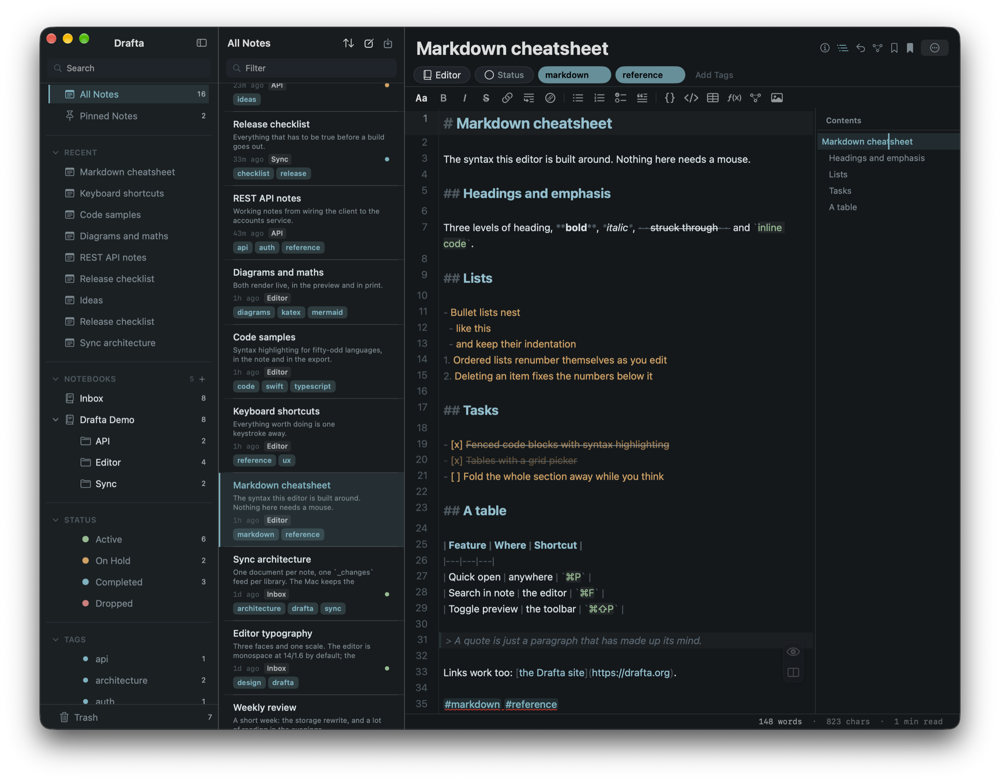
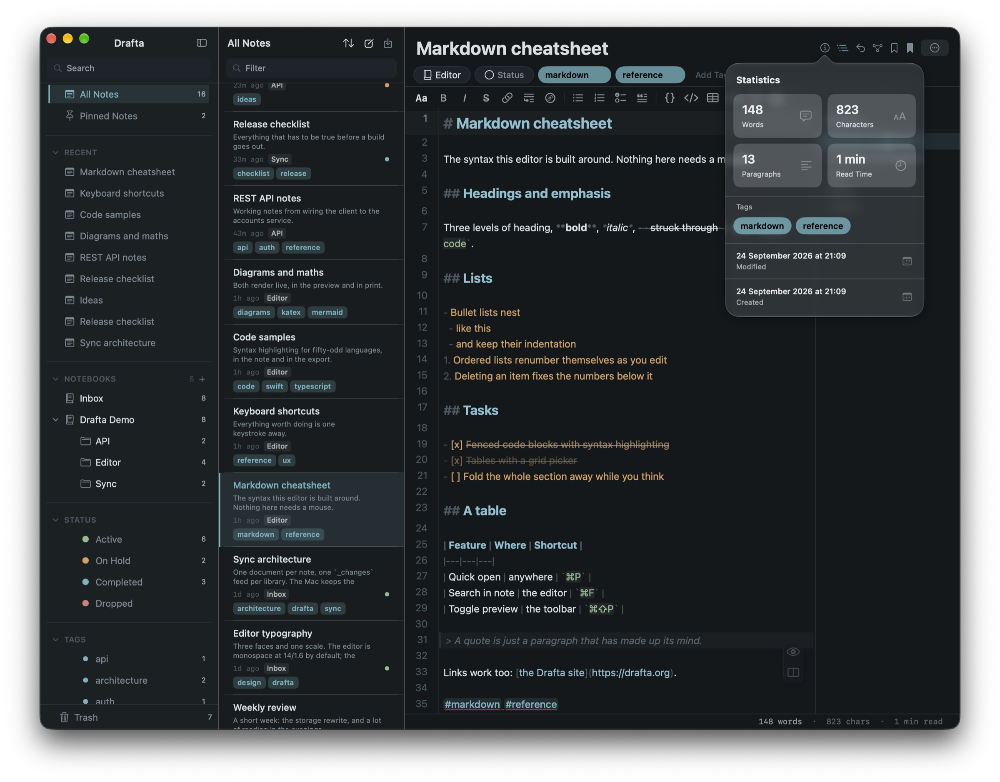
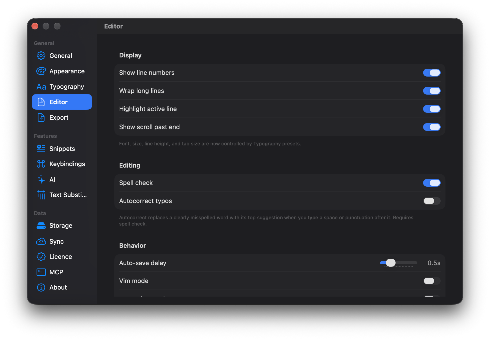

The editor is where I spend almost all my time in Drafta. That's why it's built around a simple rule: the note stays plain Markdown, and everything else — highlighting, diagrams, formulas — is drawn on top of the text and doesn't change anything in it. This is a continuation of the article Вышел Drafta 1.0.

## CodeMirror 6 and 50+ languages

Inside the window, the CodeMirror 6 editor runs. Code blocks are highlighted for more than 50 languages: Python, Rust, TypeScript, Go, SQL, YAML, Bash, and others. Headings, lists, tasks, and links are highlighted right in the source.

*Editor mode: Markdown with line numbers, a highlighted mermaid block, a list, and tasks.*

Above the text is a formatting toolbar: bold, italic, strikethrough, link, lists, tasks, code, table, formula, diagram, and image. Below the text is a status bar with a word count, character count, and reading time.

## Three view modes

Each note has three modes:

1. **Editor** — only the source Markdown.
2. **Preview** — the rendered note.
3. **Split** — source on the left, preview on the right, synchronized scrolling.

The modes are switched with buttons in the bottom-right corner of the editor. There is no separate keyboard shortcut for them. The default mode is set in the settings.

*Split: text on the left, result on the right. The wiki link in the preview already works as a link.*

## Live preview: Mermaid, KaTeX, tables

The preview renders what plain Markdown shows as text:

- Mermaid diagrams — flowchart, state, sequence, class, ER, and others;
- KaTeX formulas — inline `$…$` and block `$$…$$`;
- tables, footnotes, wiki links `[[Заголовок]]`;
- task checkboxes that can be checked with a click right in the preview.

*The mermaid block from the source has turned into the "Note on disk → Encrypt → Replicate" diagram.*

Code blocks in the preview get line numbers, a language label, and a copy button. Tables are drawn as a grid. Diagrams survive export to PDF and DOCX — they go there as images.

*Code with a language label and line numbers, with a table below it — all from plain Markdown.*

## Callouts

For a single line that can't be missed, there are callouts in the GitHub format. Five types: `NOTE`, `TIP`, `IMPORTANT`, `WARNING`, `CAUTION`. In the preview, each is drawn as a colored banner; in the editor, the background is highlighted.

> [!TIP]
> Type `>` and `!` at the beginning of a line — the editor will suggest a list of five types and complete the marker `> [!TYPE]` itself.

## Table of contents and statistics

A long note is convenient to read with a table of contents. The Contents panel collects headings and takes you to the right one on click. You can enable showing it right away in the settings.

*On the right is the note's table of contents: five headings, the current one highlighted.*

The statistics button in the note header shows the number of words, characters, paragraphs, reading time, tags, and creation and modification dates.

*Statistics for one note: 148 words, 823 characters, 13 paragraphs.*

## Editor settings

The Editor section in the settings is responsible for the appearance and behavior of the text:

- line numbers, wrapping long lines, highlighting the active line, scrolling past the end of the text;
- spell checking and autocorrecting typos;
- autosave delay;
- Vim mode.

Font, size, line spacing, and tab width live in typography presets — they are covered in a separate article about themes.

*The Editor section: display, editing, and behavior, including Vim mode.*

In addition, the editor has line bookmarks, a minimap, and a focus mode. The next article is devoted to bookmarks and links between notes.
