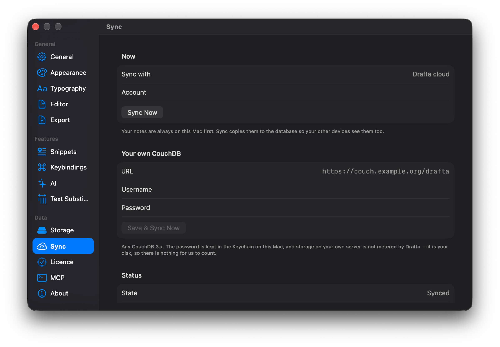

Sync in a notes app is a matter of trust: where a copy of your texts lives and who can read it. My answer in Drafta is this: I cannot read the copy in the cloud, and the copy on your Mac remains ordinary files. This article continues История ревизий и резервные копии — there, sync was the third layer of protection.

## Mac first, cloud second

The library always lives on your Mac as ordinary Markdown files. Sync copies the notes to a database so that your other devices can see them.

The copy is stored in one of two places:

| Where | What matters |
|---|---|
| Drafta cloud | the default option, included in the plan: 30 GB, unlimited number of notes |
| Your own CouchDB | any CouchDB 3.x, locally or on your server, no quota |

For your own CouchDB, the Sync settings specify the address, username, and password. The password is stored in the macOS keychain. Drafta does not count the storage on your server: it is your disk.

*The Sync section: Drafta cloud for now, fields for your own CouchDB below, Synced status at the bottom. The account address is hidden.*

## What happens between your Macs

Each note has a last-modified time. If two Macs have modified the same note, the later change wins. The Sync Now button starts syncing manually, and the State line shows its status.

## Encryption: AES-256-GCM

Notes are encrypted on your Mac before being sent. The algorithm is AES-256-GCM, and the key is derived from the library password via PBKDF2-HMAC-SHA256. The service stores ciphertext and does not have the key.

The server sees:

- the account email and plan;
- for each note — its id, last-modified time, and the size of the encrypted data.

The title, text, tags, and attachments remain ciphertext. The server sees the modification time because it is used to decide whose version is newer.

The same scheme works for both the Drafta cloud and your own CouchDB. Wherever the copy lives, notes are encrypted before being sent.

## The encryption boundary

Encryption protects the sync path, not your disk. The library on the Mac remains ordinary Markdown files: `grep`, git, and other editors continue to work. The disk is protected by FileVault.

This is a deliberate choice. Encrypted files on disk would cut you off from your own notes. An unencrypted copy on the server would hand them over to anyone who gains access to the server. Drafta does neither.

## Account and two passwords

Drafta requires an account to work. It starts a 30-day trial, stores your plan, and — if you have not connected your own CouchDB — holds the encrypted cloud copy.

*Account creation: a confirmation email, 30 days of trial, and a separate library password.*

The account has two passwords with different jobs:

1. **The account password** is needed to sign in. It goes to the server over TLS, as with any sign-in.
2. **The library password** never leaves your Mac. The encryption key is derived from it.

The server can verify that it is you, but it cannot decrypt the notes.

The trial begins with email confirmation and does not require a card. After it, without a Drafta plan, the app works in read-only mode: you can open, search, and read notes, while creating, editing, and exporting wait for a plan.

> [!WARNING]
> No one can reset the library password: the server never had it. The notes on your Mac will remain readable in any case, but the encrypted copy in the cloud is opened only by this password. Keep it in a password manager.

The next article is about how the AI assistant works in Drafta and where provider keys are stored.
