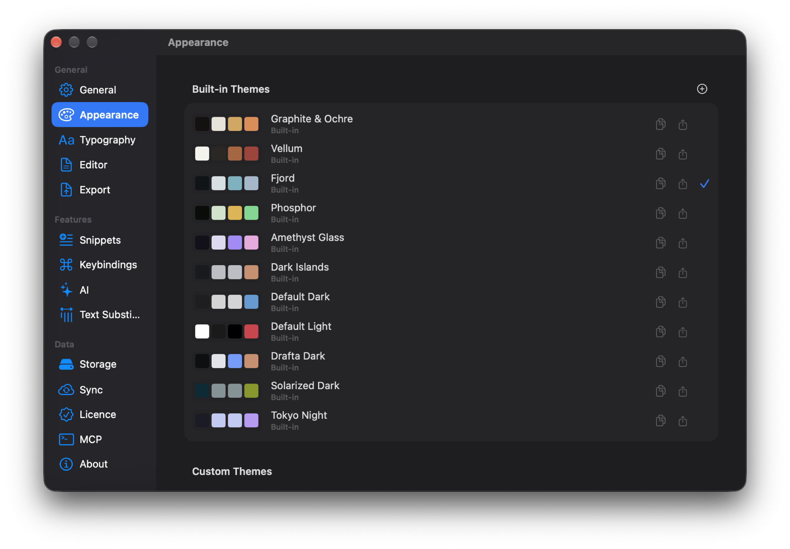
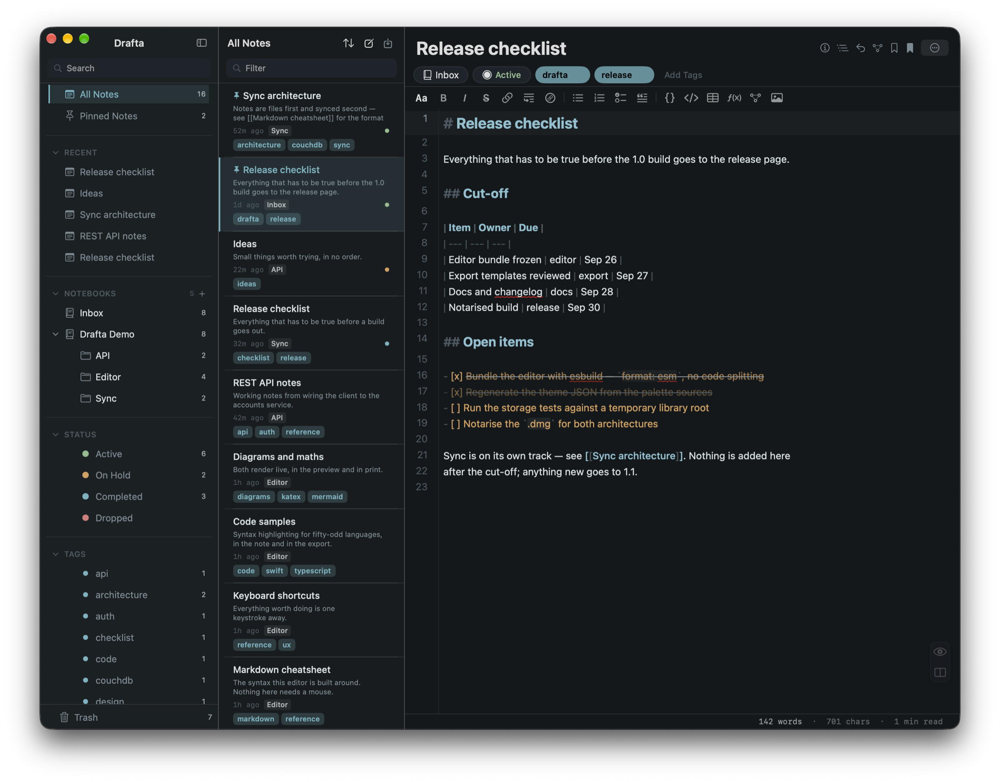
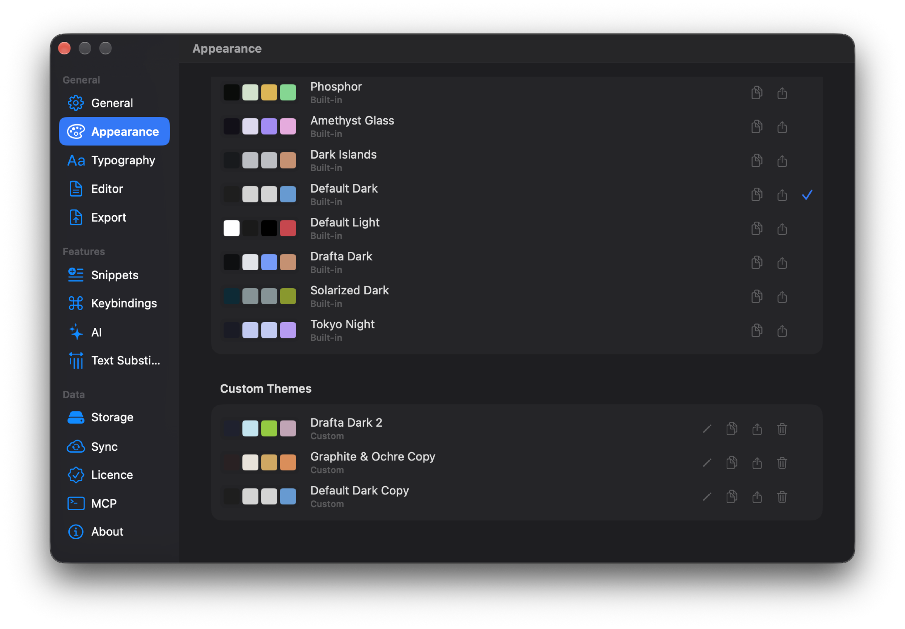
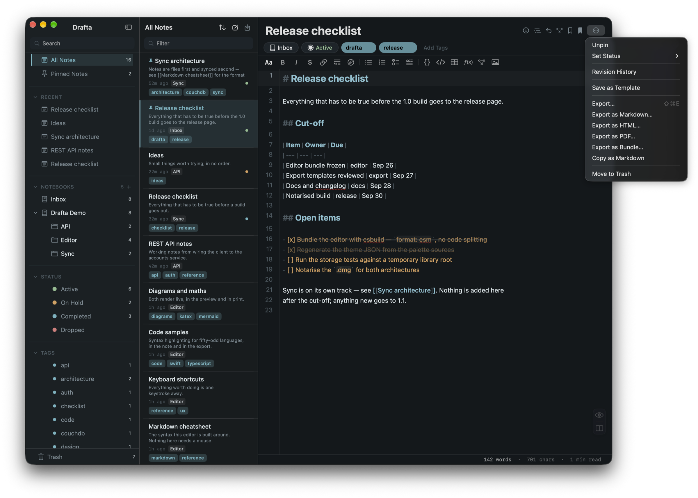

I read notes more often than I write them, so the appearance of text in Drafta is customizable in as much detail as the editor's behavior. This article covers themes, typography, and how a note looks outside the app, after export. This is the last article in the series that began with Вышел Drafta 1.0.

## Eleven built-in themes

Drafta has 11 built-in themes. Five signature ones:

- Graphite & Ochre
- Vellum
- Fjord
- Phosphor
- Amethyst Glass

And six more: Default Light, Default Dark, Drafta Dark, Dark Islands, Tokyo Night, and Solarized Dark.

*Appearance: eleven built-in themes, each with four color swatches. Fjord is selected.*

A theme colors the entire window: the sidebar, the note list, the editor, and Markdown highlighting.

*Fjord theme: cool blue-gray tones across all three columns of the window.*

*Light theme: the same sidebar and note list on a warm background.*

The styling of the window title bar, menus, and system dialogs follows the editor theme by default. It can be pinned to light or dark separately. If a theme supports a translucent window and it's enabled, three sliders set the glass intensity separately for the editor, the note list, and the sidebar.

## Custom themes

Built-in themes are read-only. To make your own, I duplicate a built-in one and edit the copy in the theme editor. Custom themes live in a separate Custom Themes section: they can be edited, duplicated, exported, and deleted.

*Custom Themes: copies of built-in themes, each with buttons for edit, duplicate, export, and delete.*

A theme is a JSON file. You can create a theme without the editor too: just put a `.json` file into the themes folder. A button in the Appearance section opens that folder in Finder.

> [!TIP]
> A theme you like is easy to share with a colleague: export it to JSON, and they'll put the file into their themes folder.

## Typography

Font, size, line spacing, and tab width are grouped into presets. There are four built-in ones:

| Preset | Size | Line spacing |
|---|---|---|
| Default | 14 pt | 1.6 |
| Reading | 18 pt | 1.8 |
| Compact | 13 pt | 1.4 |
| Mono | 14 pt | 1.6 |

Below the list is a preview: three heading levels, a paragraph, and inline code. The "+" button creates your own preset.

*Typography: four presets with size and spacing, preview below.*

## Export: four formats

A note leaves Drafta in four formats: PDF, DOCX, HTML, and Markdown. The export dialog opens with ⇧⌘E or the Export… item in the note menu. Local images are carried over along with the note.

The same menu has quick items: export straight to the desired format, Export as Bundle… — a ZIP archive with the note, and Copy as Markdown — the source to the clipboard.

*Note menu: export dialog, quick formats, archive, and copying Markdown.*

## Appearance profiles

The look of the result is set by a profile. There are three built-in ones: Clean, Developer, and Academic. The selected profile is the one the export dialog opens with. Built-in profiles are read-only: to change a profile, you duplicate it.

*Export: Clean, Developer, and Academic profiles. Clean opens by default.*

In the export dialog itself, you choose the format and profile, page size and orientation, title page, headers and footers, and table of contents. The result preview is visible there too. Changes in the dialog apply only to the current export and don't modify the profile.

Mermaid diagrams go into PDF and DOCX as images, so a diagram from a note remains a diagram in the document too.

## Import

In the other direction, Drafta imports `.md` and `.html`, including exports from Bear. Notes from another app become the same Markdown files as the rest.

That wraps up the series on Drafta 1.0. If something is missing, write to us — it's the best way to influence future versions.
