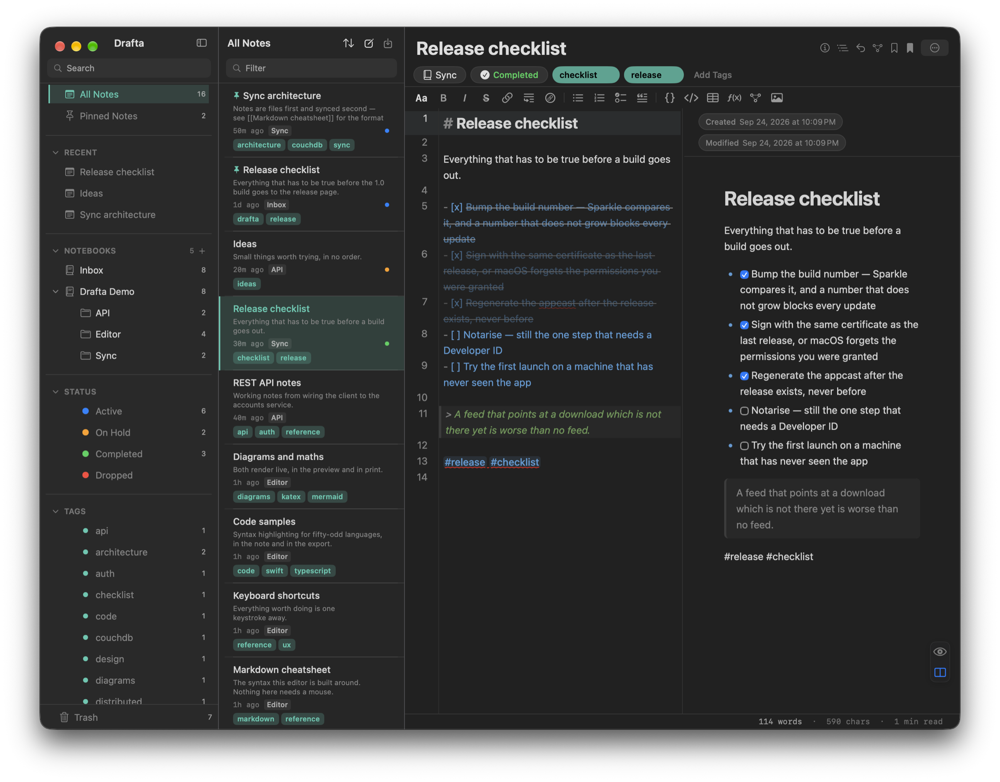

The first decision I made in Drafta was not to set up my own database. A note is a file. Everything else in the library — notebooks, tags, statuses, links — is built on top of these files. I wrote about the editor's design in article Редактор Drafta: Markdown, превью и split.

## One file per note

The library lives on your Mac in the `Library` folder. Inside is the `notes` folder, where each note is stored as a separate `.md` file, and next to it is the `revisions` folder with revision history. The file begins with YAML front matter:

```yaml
---
id: <UUID заметки>
title: Release checklist
schemaVersion: 1
createdAt: "2026-09-24T19:09:00.000Z"
updatedAt: "2026-09-24T19:09:00.000Z"
notebookId: <UUID блокнота>
status: completed
extraTags: [release]
---
# Release checklist
```

Below the front matter is regular Markdown. Such a file can be read by `grep`, git, and VS Code. There is no closed format between you and the text, and changing your plan will not take it away.

## Notebooks

Notebooks nest inside each other without a depth limit. In the sidebar they are shown as a tree with note counts. A note can be dragged from the list into another notebook with the mouse. Next to the notebooks in the sidebar are All Notes, pinned notes, recent, and trash.

The trash can empty itself. In the General section of settings, you can choose the period: keep forever, 7, 30, or 90 days.

## Tags

Drafta picks up tags from the text: a word with a hash at the beginning becomes a tag. A tag with a slash is a path; this is how nested tags are built. Tags can also be added manually with the Add Tags button under the note title. Each tag has its own color: it is changed by right-clicking the tag.

## Statuses

A note has a status. There are four:

| Status | What it is for |
|---|---|
| Active | in progress |
| On Hold | postponed, but not forgotten |
| Completed | done |
| Dropped | decided not to do |

The status is visible as a colored dot in the note list and as a badge under the title. In the sidebar there is a filter for each status with a counter. A side project waiting its turn goes to On Hold, not to the trash.



*Completed status under the note title and a green dot in the list on the left.*

This blog runs on statuses. A note with Completed status and a site section tag goes to drafta.org by itself — this article was published that way too.

## Templates

Any note can be saved as a template: the Save as Template item in the note menu. A new note from a template is created through the template picker window.

> [!TIP]
> ⌘N creates an empty note in the current notebook, ⇧⌘N opens the template picker.

## Wiki links and graph

Notes are linked with wiki links: `[[Заголовок заметки]]`. In preview, the link becomes clickable. A link to a heading that does not yet exist is shown as broken — this is a useful signal, not an error.

The Graph panel builds a graph around the open note. The nodes are linked notes and tags. The depth is switched with the 1 and 2 buttons: the note's neighbors, or also the neighbors' neighbors.

## Bookmarks

A bookmark marks a line inside a note. The Bookmarks panel gathers them in one place and takes you to the desired line.


*On the right are the Bookmarks and Graph panels. The graph shows the note's tags and the linked note Sync architecture.*

> [!TIP]
> ⇧⌘B sets or removes a bookmark on the current line. ⌥⌘B opens all bookmarks.

## Search

The Filter field above the list searches among notes, while the Search field in the sidebar narrows the notebook tree and the tag list. To jump to any note, there is ⌘P — fuzzy search across the entire library. More about it and other keyboard shortcuts in the next article.
