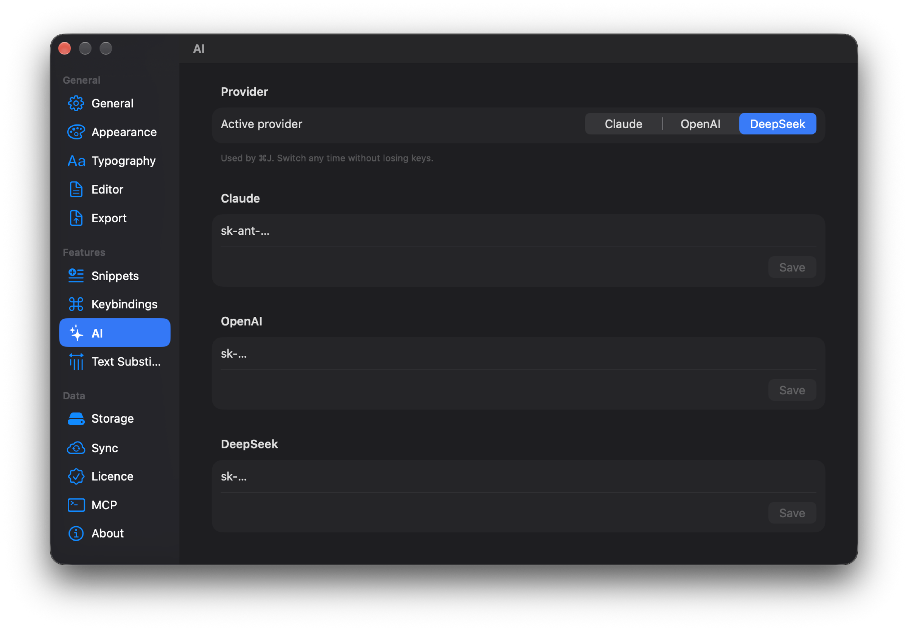

AI в Drafta живёт там же, где текст: в редакторе, у курсора. Я не делал отдельный чат, в который надо копировать куски заметки. Нажимаете ⌘J — поповер открывается прямо в строке, результат появляется в тексте, и вы решаете, оставить его или нет. Сочетание ⌘J я уже упоминал в статье [Drafta с клавиатуры: сочетания, сниппеты, автозамены](/ru/blog/drafta-s-klaviatury).

## Ваш ключ, ваш провайдер

Ассистент работает с тем провайдером, для которого у вас есть API-ключ:

| Провайдер | Модель |
|---|---|
| Anthropic | `claude-haiku-4-5` |
| OpenAI | `gpt-4o-mini` |
| DeepSeek | `deepseek-chat` |

Ключи вводятся в разделе AI настроек и хранятся в связке ключей macOS. Активный провайдер переключается одним кликом, сохранённые ключи при этом не теряются. Запросы идут по вашему ключу, поэтому расход токенов оплачивается у выбранного провайдера.

*Раздел AI: активный провайдер — DeepSeek, у каждого провайдера своё поле ключа.*

Если ключа для активного провайдера нет, ⌘J открывает эти настройки вместо поповера.

## Два режима: правка и вставка

Поповер понимает, что вы хотите сделать, по выделению:

- **есть выделение** — режим Edit selection: ассистент переписывает выделенный текст;
- **выделения нет** — режим Insert at cursor: ассистент пишет новый текст на месте курсора.

Вместе с запросом провайдеру уходит текст вокруг курсора и заголовок заметки. Так ассистент продолжает мысль в том же стиле, а не с чистого листа.

## Семь готовых команд

В поповере есть готовые команды:

| Команда | Что делает | Нужно выделение |
|---|---|---|
| Improve writing | улучшает стиль и грамматику | да |
| Make shorter | сокращает, сохраняя главное | да |
| Make longer | расширяет деталями и примерами | да |
| Fix grammar | исправляет только грамматику и орфографию | да |
| Summarize | пересказывает в 1–3 пунктах | нет |
| Continue writing | продолжает текст от курсора | нет |
| Generate diagram | рисует диаграмму Mermaid по описанию | нет |

Команды, которым нужно выделение, недоступны в режиме вставки. Если ни одна команда не подходит, пишите свою инструкцию прямо в поле поповера: «Tell AI what to change…» при правке или «What to insert here…» при вставке.

Текстовые команды просят модель сохранять язык и Markdown исходного текста. Русская заметка остаётся русской, списки остаются списками.

## Принять или перегенерировать

Ответ появляется прямо в тексте по мере генерации. В режиме правки старый фрагмент приглушается, чтобы было видно, что меняется. Когда ответ готов, остаётся выбрать:

> [!TIP]
> ⌘↩ принимает результат, ⌘R генерирует его заново. Кнопка Reject отменяет вставку.

Если провайдер обрезал ответ своим лимитом, поповер об этом предупреждает. Обрезанный ответ нельзя принять вместо выделения — он заменил бы текст более коротким.

## Generate diagram

Эта команда закрывает разрыв между текстом и схемой. Вы описываете одной фразой, что нужно нарисовать, — ассистент возвращает только блок `mermaid`, без пояснений вокруг, и превью сразу рисует схему. Дальше диаграмму можно править руками как обычный текст.

## ⌘J можно переназначить

Команда ассистента живёт в том же реестре, что и форматирование. В разделе Keybindings настроек ей можно назначить другое сочетание. Ассистент открывается и из меню AI → Ask AI….

## Ассистент внутри и ассистент снаружи

Ассистент по ⌘J работает с одной заметкой, которая сейчас открыта. Если нужен AI, который видит всю библиотеку — ищет, читает, создаёт и дописывает заметки, — для этого в Drafta есть встроенный MCP-сервер. О нём следующая статья.
