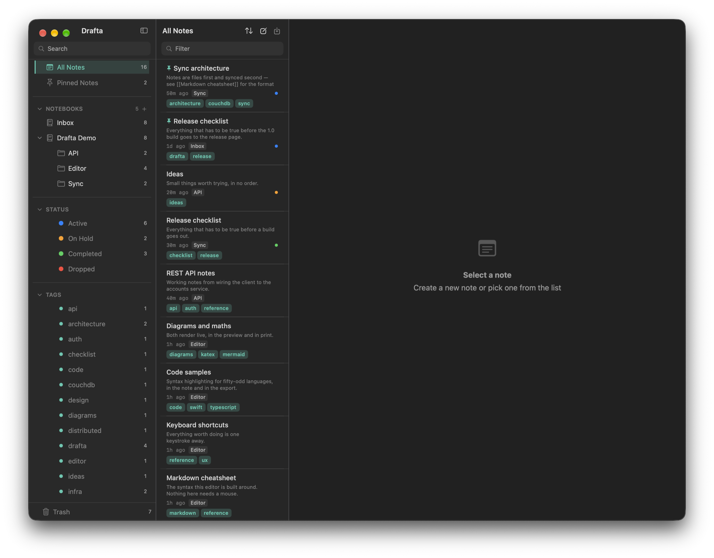

Сегодня выходит Drafta 1.0 — первый публичный релиз моего редактора заметок для macOS. Я делаю его для программистов: для тех, кто пишет заметки в Markdown, держит в них код и не хочет запирать тексты в чужой базе.

*Главное окно: сайдбар с блокнотами, статусами и тегами, список заметок и место под редактор.*

## Что это за приложение

Drafta — нативное приложение на Swift и SwiftUI. Это не веб-приложение и не оболочка Electron. Редактор внутри — CodeMirror 6 с подсветкой больше 50 языков.

Каждая заметка — обычный файл `.md` с YAML front-matter у вас на диске. Его откроет VS Code, найдёт `grep`, примет git. Если вы перестанете пользоваться Drafta, заметки останутся читаемыми файлами. Исходный код приложения открыт под лицензией Apache 2.0.

## Что есть в 1.0

Редактор:

- три режима просмотра — редактор, превью и split с синхронной прокруткой;
- живое превью таблиц, диаграмм Mermaid, формул KaTeX, сносок и wiki-ссылок;
- оглавление, закладки, минимап, режим фокуса, поиск по ⌘F.

Библиотека:

- блокноты с вложенностью без ограничения глубины;
- теги из текста, в том числе вложенные через `/`;
- четыре статуса заметки: Active, On Hold, Completed, Dropped;
- шаблоны, сниппеты, корзина с автоочисткой, граф связей между заметками;
- до 30 ревизий на заметку с диффом и возвратом в один клик.

Данные и интеграции:

- синхронизация через облако Drafta или ваш собственный CouchDB, с шифрованием AES-256-GCM на вашем Mac;
- экспорт в PDF, DOCX, HTML и Markdown, импорт `.md` и `.html`;
- AI-ассистент по ⌘J с вашим ключом Anthropic, OpenAI или DeepSeek;
- встроенный MCP-сервер: Claude и другие MCP-клиенты читают и ведут библиотеку;
- одиннадцать встроенных тем и свои темы в JSON;
- автообновление через Sparkle, проверка раз в сутки.

О каждой из этих частей я пишу отдельную статью в этом блоге. Сам блог написан в Drafta и опубликован прямо из неё.

## Для кого

Drafta подойдёт вам, если:

- вы пишете заметки в Markdown и вставляете в них код, SQL, конфиги и диаграммы;
- хотите, чтобы заметки лежали файлами, а не строками в закрытой базе;
- работаете на Mac с macOS 26 или новее — на Apple Silicon или Intel.

## Где скачать

Страница приложения — [drafta.org](https://drafta.org). Там есть ссылка на DMG из последнего релиза.

1. Откройте DMG и перетащите **Drafta.app** в **Applications**.
2. Сборка пока не нотаризована, поэтому macOS заблокирует первый запуск.
3. Откройте «Системные настройки» → «Конфиденциальность и безопасность», пролистайте до сообщения о Drafta и нажмите «Всё равно открыть».

macOS спросит об этом один раз. Дальше обновления приходят сами, а **Drafta → Check for Updates…** проверяет их по требованию.

> [!NOTE]
> Для работы нужен аккаунт Drafta. У него два пароля: пароль аккаунта для входа и пароль библиотеки, который не покидает ваш Mac. Пароль библиотеки не сбросит никто — храните его в менеджере паролей.

## Сколько стоит

Тариф один, периодов оплаты два:

| Период | Цена |
|---|---|
| Месяц | $9.99 |
| Год | $95.88 |

Периоды различаются тем, как вы платите, а не тем, что получаете. В тариф входит всё приложение и облачная синхронизация.

Каждый новый аккаунт начинается с 30-дневного триала, карта не нужна. Когда триал закончится, Drafta перейдёт в режим только для чтения: заметки можно открывать, искать и читать, а создание, правка и экспорт ждут тарифа. Оплата пока не подключена, так что сегодня ничего не списывается.

## Что дальше

- **Нотаризация и Developer ID.** Уберёт шаг «Всё равно открыть» при первом запуске. В работе.
- **iOS.** Цель iOS уже живёт рядом с macOS. Релиза нет, и дату я не назову, пока не будет готово.
- **Windows и Linux.** Сборка на Rust и Tauri. Запланировано, но не начато: приложение для macOS идёт первым.

Если вы попробуете Drafta 1.0, мне важно знать, что мешает и чего не хватает.
