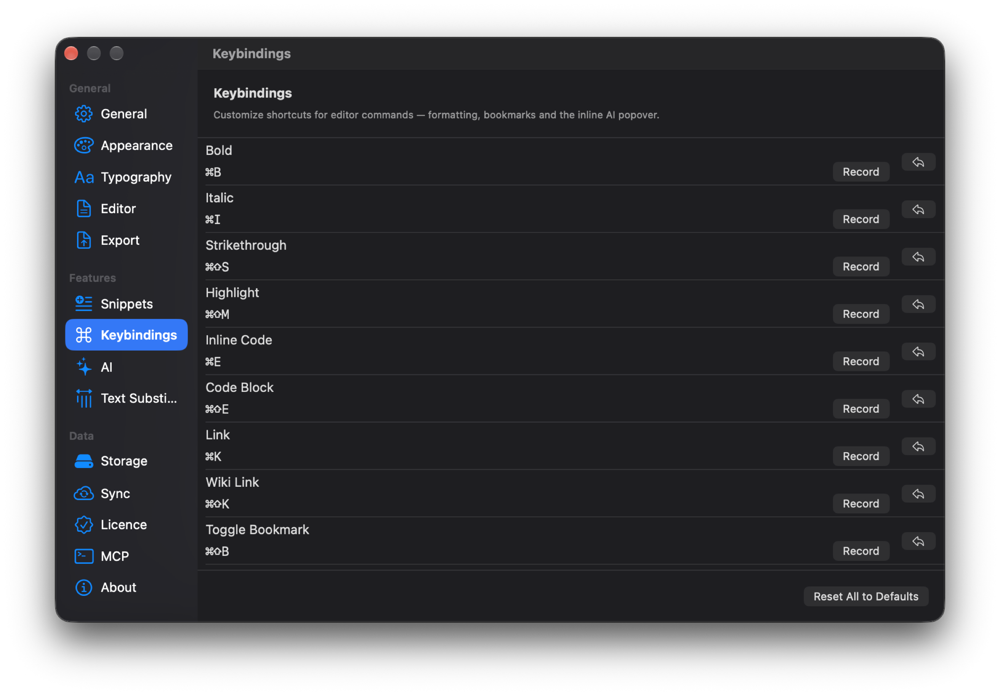

Я пишу заметки между двумя задачами в редакторе кода, поэтому Drafta должна отвечать клавиатуре так же быстро, как IDE. В этой статье — сочетания, быстрый переход, сниппеты и автозамены. Про то, как устроена сама библиотека, — в статье [Заметки — это файлы: блокноты, теги, статусы и связи](/ru/blog/zametki-eto-faily).

## Быстрый переход по ⌘P

⌘P открывает панель быстрого перехода. Это нечёткий поиск по всем заметкам: достаточно нескольких букв из заголовка. У панели четыре префикса, которые сужают поиск:

| Префикс | Что ищет |
|---|---|
| `>` | команды приложения |
| `b ` | блокноты |
| `t ` | теги |
| `#` | заголовки внутри открытой заметки |

Буквенным префиксам нужен пробел после буквы, поэтому запрос `book` ищет слово, а не блокноты.

*Быстрый переход: заметки с блокнотом, тегами и временем правки, внизу — подсказки Commands, Notebooks, Tags, Outline.*

## Сочетания приложения

| Сочетание | Действие |
|---|---|
| ⌘N | новая заметка в текущем блокноте |
| ⇧⌘N | новая заметка из шаблона |
| ⌘P | быстрый переход |
| ⌘F | поиск в заметке |
| ⌘J | AI-ассистент |
| ⌥⌘L | показать или скрыть список заметок |
| ⌥⌘B | все закладки |
| ⇧⌘E | экспорт |

Режимы редактор, превью и split переключаются кнопками — отдельного сочетания для них нет.

## Сочетания редактора

Команды форматирования работают внутри текста заметки:

| Сочетание | Действие |
|---|---|
| ⌘B | жирный |
| ⌘I | курсив |
| ⇧⌘S | зачёркивание |
| ⇧⌘M | выделение маркером |
| ⌘E | код в строке |
| ⌘K | ссылка |
| ⇧⌘K | wiki-ссылка |
| ⌘1, ⌘2, ⌘3 | заголовок первого, второго, третьего уровня |
| ⇧⌘L | маркированный список |
| ⇧⌘O | нумерованный список |
| ⇧⌘X | задача |
| ⇧⌘. | цитата |
| ⇧⌘B | закладка на строке |
| ⌥↑, ⌥↓ | перенести строку вверх или вниз |

В таблице Tab и ⇧Tab переходят между ячейками. Enter в списке задач продолжает список новой задачей.

## Своё сочетание для любой команды

Сочетания редактора переназначаются в разделе Keybindings настроек. Кнопка Record записывает новое сочетание, стрелка рядом возвращает одно значение по умолчанию, Reset All to Defaults — все сразу. У сносок, формул, диаграмм и картинок сочетаний по умолчанию нет — их можно назначить самому.

*Keybindings: у каждой команды своё сочетание, кнопка Record и сброс.*

## Сниппеты через слеш

Слеш в редакторе открывает список сниппетов. В Drafta 14 встроенных:

- `/img`, `/link`, `/table`, `/code` — картинка, ссылка, таблица, блок кода;
- `/h1`, `/h2`, `/h3`, `/quote`, `/task`, `/hr` — заголовки, цитата, задача, горизонтальная линия;
- `/date`, `/time`, `/datetime`, `/today` — текущая дата и время.

В теле сниппета работают переменные `{{cursor}}` — куда встанет курсор, `{{date}}` и `{{time}}`. Встроенные сниппеты можно править, кнопка Add добавляет свой, Restore defaults возвращает исходный набор.

*Snippets: у каждого сниппета триггер, название и тело с переменными.*

> [!TIP]
> Наберите `/today` в пустой заметке — получите жирную сегодняшнюю дату и курсор на строке ниже. Удобно для дневника.

## Автозамены при наборе

Раздел Text Substitutions собирает замены, которые срабатывают прямо во время набора:

- два дефиса превращаются в длинное тире;
- двойной пробел ставит точку;
- скобки и кавычки закрываются сами;
- выражение вида `2+2=` заменяется результатом;
- типографские кавычки;
- автодополнение тегов после решётки.

Каждую замену можно выключить отдельно, если она мешает.

*Text Substitutions: шесть замен, каждая выключается своим переключателем.*

Одно сочетание из таблицы стоит отдельной статьи — ⌘J открывает AI-ассистента. Но сначала о том, как Drafta хранит историю правок.
