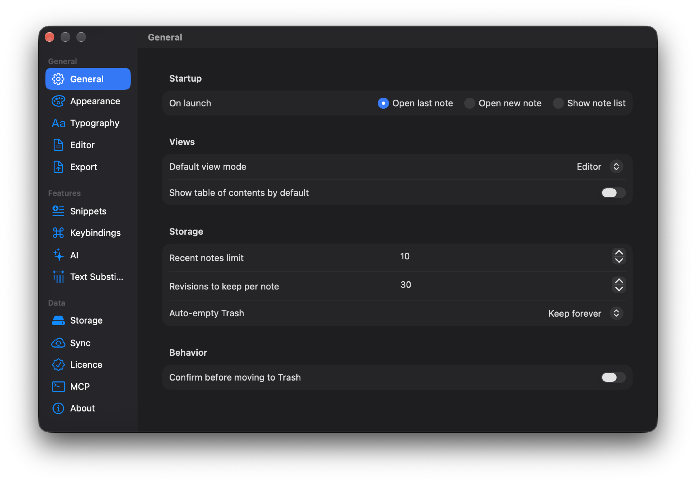
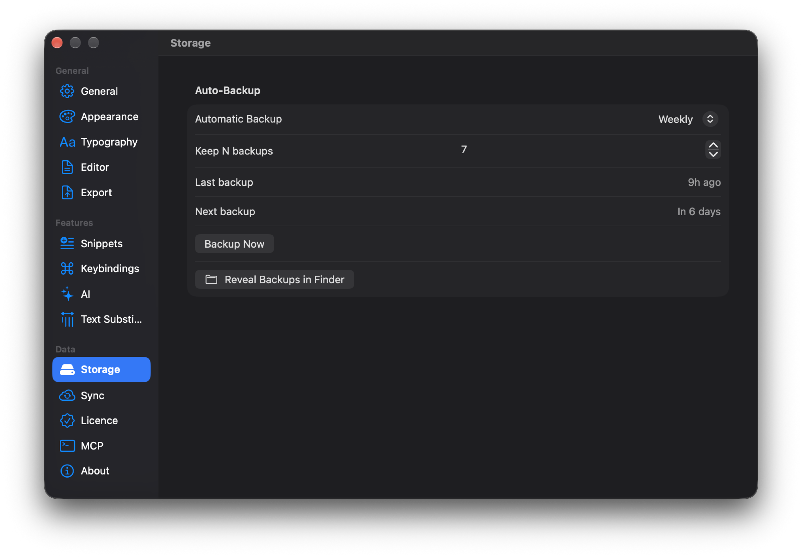

Заметки меняются, и иногда вчерашняя версия лучше сегодняшней. В Drafta на этот случай два механизма: история ревизий для каждой заметки и резервные копии всей библиотеки. Оба работают локально, на вашем Mac. О том, как лежат сами заметки, я писал в статье [Заметки — это файлы: блокноты, теги, статусы и связи](/ru/blog/zametki-eto-faily).

## Ревизии: до 30 на заметку

Drafta сохраняет прежние версии заметки в папку `revisions` рядом с заметками. По умолчанию на заметку хранится до 30 ревизий.

Ревизия сохраняется и тогда, когда заметку переписывает не человек. Если AI-агент через MCP-сервер заменяет текст заметки, прежний текст остаётся ревизией. Агенту можно разрешить писать в библиотеку и не бояться за исходный текст.

## Окно истории

История открывается пунктом Revision History в меню заметки или в контекстном меню списка. Слева — список ревизий: дата, время, сколько строк добавлено и сколько слов было в версии. Справа — unified diff.

Дифф строится в двух режимах:

- **vs Current** — выбранная ревизия против текущего текста;
- **vs Previous** — выбранная ревизия против предыдущей.

Кнопка Restore This Version возвращает выбранную версию в заметку.

*История заметки: ревизия слева, дифф против предыдущей версии справа, кнопка Restore This Version сверху.*

> [!TIP]
> Режим vs Previous удобен, чтобы понять, что именно поменялось в конкретной правке. Режим vs Current — чтобы решить, стоит ли возвращать версию.

## Сколько хранить

Лимит ревизий настраивается в разделе General: от 10 до 200 на заметку. Там же — срок автоочистки корзины и число недавних заметок в сайдбаре.

*General: 30 ревизий на заметку, 10 недавних заметок, корзина хранится всегда.*

Раздел General задаёт ещё и поведение при запуске: открыть последнюю заметку, создать новую или показать список.

## Резервные копии библиотеки

Ревизии защищают отдельную заметку. Резервная копия защищает всю библиотеку сразу: Drafta упаковывает её в ZIP-архив с именем вида `Drafta-Library-Backup-<дата>.zip` и кладёт в папку `Backups` рядом с библиотекой.

Раздел Storage настроек управляет автоматическими копиями:

| Настройка | Значения |
|---|---|
| Automatic Backup | Off, Daily, Weekly, Monthly |
| Keep N backups | от 1 до 30 архивов |

Когда архивов становится больше лимита, самые старые удаляются. В разделе видно, когда была последняя копия и когда будет следующая. Кнопка Backup Now делает копию сразу, Reveal Backups in Finder открывает папку с архивами.

*Storage: еженедельная копия, 7 архивов, кнопки Backup Now и Reveal Backups in Finder.*

Копию можно сделать и вручную, в любое место на диске: пункт Backup Library Now… в меню файла.

## Три слоя защиты

Вместе это даёт три независимых слоя:

1. **Ревизии** — откат одной заметки на одну из последних версий.
2. **Резервные копии** — архив всей библиотеки по расписанию.
3. **Синхронизация** — зашифрованная копия вне вашего Mac.

Поверх этого сами заметки — обычные Markdown-файлы. Их можно положить в git и получить четвёртый слой, который Drafta не контролирует вовсе.

О третьем слое, синхронизации и шифровании, — следующая статья.
