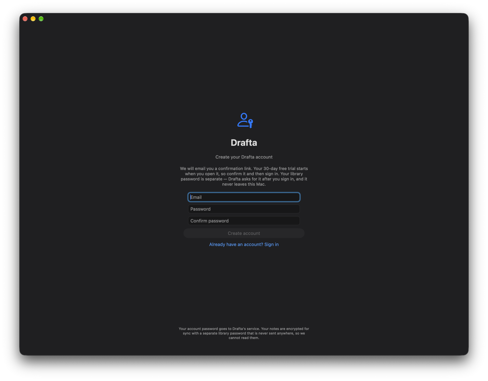

Синхронизация в заметочнике — это вопрос доверия: где лежит копия ваших текстов и кто может её прочитать. Мой ответ в Drafta такой: копию в облаке я прочитать не могу, а копия на вашем Mac остаётся обычными файлами. Эта статья продолжает [История ревизий и резервные копии](/ru/blog/istoriya-reviziy-i-bekapy) — там синхронизация была третьим слоем защиты.

## Сначала Mac, потом облако

Библиотека всегда лежит на вашем Mac обычными Markdown-файлами. Синхронизация копирует заметки в базу, чтобы их видели другие ваши устройства.

Копия хранится в одном из двух мест:

| Где | Что важно |
|---|---|
| Облако Drafta | вариант по умолчанию, входит в тариф: 30 GB, число заметок не ограничено |
| Свой CouchDB | любой CouchDB 3.x, локально или на вашем сервере, без квоты |

Для своего CouchDB в настройках Sync указываются адрес, имя пользователя и пароль. Пароль хранится в связке ключей macOS. Хранилище на вашем сервере Drafta не считает: это ваш диск.

*Раздел Sync: облако Drafta сейчас, поля для своего CouchDB ниже, статус Synced внизу. Адрес аккаунта скрыт.*

## Что происходит между вашими Mac

У каждой заметки есть время последнего изменения. Если два Mac изменили одну заметку, побеждает более позднее изменение. Кнопка Sync Now запускает синхронизацию вручную, а строка State показывает её состояние.

## Шифрование: AES-256-GCM

Заметки шифруются на вашем Mac до отправки. Алгоритм — AES-256-GCM, ключ получается из пароля библиотеки через PBKDF2-HMAC-SHA256. Сервис хранит шифротекст, ключа у него нет.

Сервер видит:

- почту аккаунта и тариф;
- по каждой заметке — её id, время последнего изменения и размер зашифрованных данных.

Заголовок, текст, теги и вложения остаются шифротекстом. Время изменения сервер видит потому, что по нему решается, чья версия новее.

Одна и та же схема работает и для облака Drafta, и для вашего CouchDB. Где бы ни лежала копия, заметки шифруются до отправки.

## Граница шифрования

Шифрование защищает путь синхронизации, а не ваш диск. Библиотека на Mac остаётся обычными Markdown-файлами: `grep`, git и другие редакторы продолжают работать. Диск защищает FileVault.

Это сознательный выбор. Зашифрованные файлы на диске отрезали бы вас от собственных заметок. Незашифрованная копия на сервере отдала бы их тому, кто получит доступ к серверу. Drafta не делает ни того, ни другого.

## Аккаунт и два пароля

Для работы Drafta нужен аккаунт. Он запускает 30-дневный триал, хранит ваш тариф и — если вы не подключили свой CouchDB — держит зашифрованную облачную копию.

*Создание аккаунта: письмо с подтверждением, 30 дней триала и отдельный пароль библиотеки.*

У аккаунта два пароля с разными задачами:

1. **Пароль аккаунта** нужен для входа. Он уходит на сервер по TLS, как при любом входе.
2. **Пароль библиотеки** не покидает ваш Mac. Из него получается ключ шифрования.

Сервер может убедиться, что это вы, но расшифровать заметки не может.

Триал начинается с подтверждения почты и не требует карты. После него без тарифа Drafta работает только на чтение: открывать, искать и читать заметки можно, а создание, правка и экспорт ждут тарифа.

> [!WARNING]
> Пароль библиотеки не сбросит никто: у сервера его никогда не было. Заметки на вашем Mac останутся читаемыми в любом случае, но зашифрованная копия в облаке открывается только этим паролем. Храните его в менеджере паролей.

В следующей статье — о том, как в Drafta работает AI-ассистент и где хранятся ключи провайдеров.
