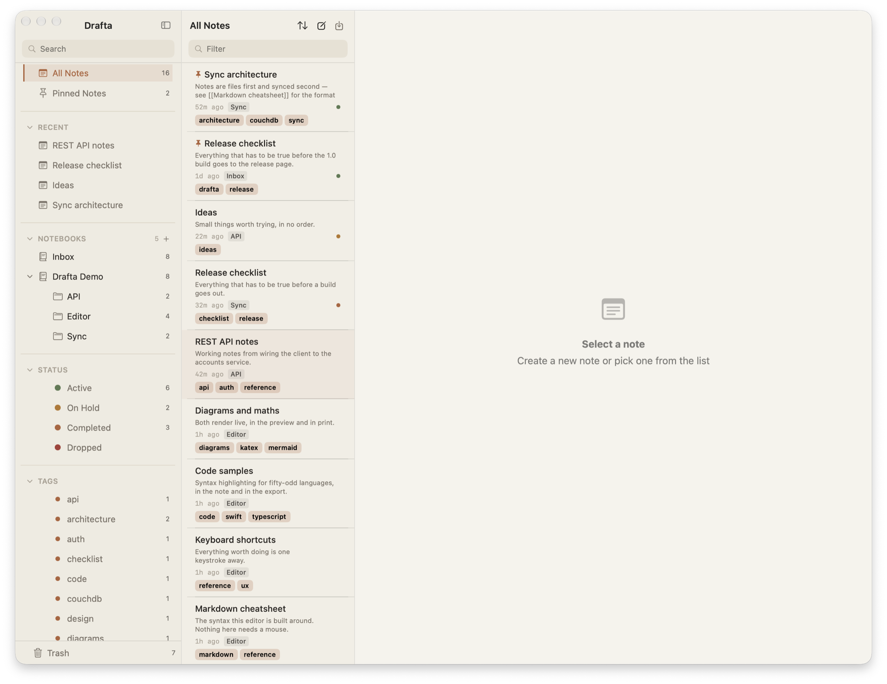
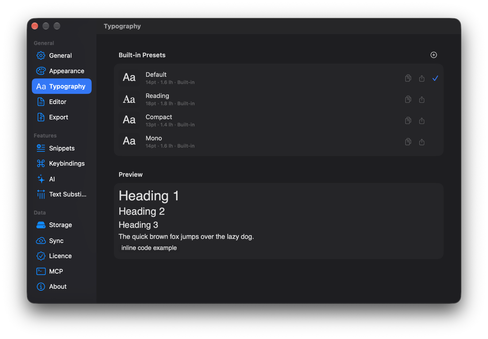
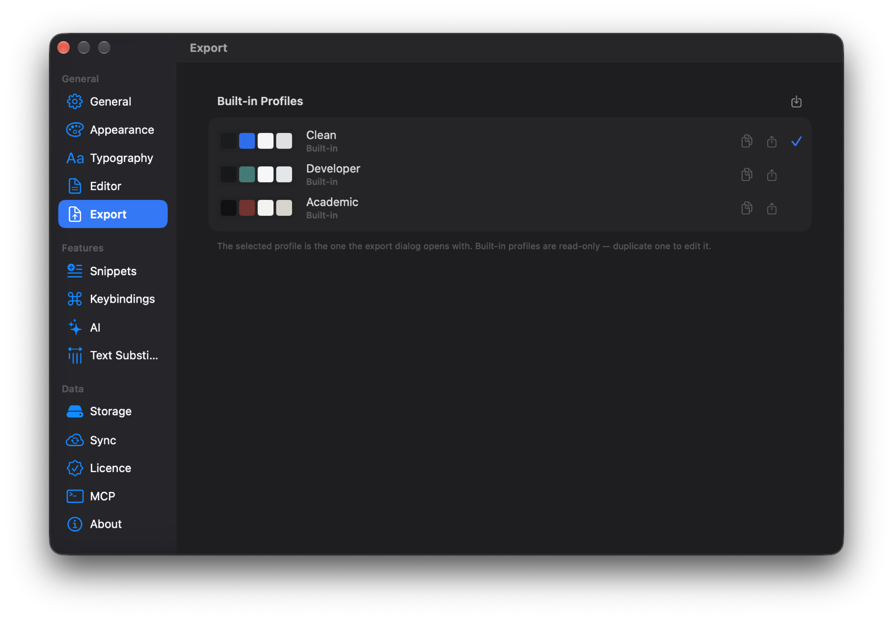

Заметки я читаю чаще, чем пишу, поэтому вид текста в Drafta настраивается так же подробно, как поведение редактора. В этой статье — темы, типографика и то, как заметка выглядит за пределами приложения, после экспорта. Это последняя статья серии, которая началась с [Вышел Drafta 1.0](/ru/blog/drafta-1-0).

## Одиннадцать встроенных тем

В Drafta 11 встроенных тем. Пять фирменных:

- Graphite & Ochre
- Vellum
- Fjord
- Phosphor
- Amethyst Glass

И ещё шесть: Default Light, Default Dark, Drafta Dark, Dark Islands, Tokyo Night и Solarized Dark.

*Appearance: одиннадцать встроенных тем, у каждой четыре цветовых образца. Выбрана Fjord.*

Тема красит всё окно: сайдбар, список заметок, редактор и подсветку Markdown.

*Тема Fjord: холодные сине-серые тона во всех трёх колонках окна.*

*Светлая тема: те же сайдбар и список заметок на тёплом фоне.*

Оформление заголовка окна, меню и системных диалогов по умолчанию следует теме редактора. Его можно закрепить светлым или тёмным отдельно. Если тема поддерживает полупрозрачное окно и оно включено, три ползунка задают интенсивность стекла отдельно для редактора, списка заметок и сайдбара.

## Свои темы

Встроенные темы только для чтения. Чтобы сделать свою, я дублирую встроенную и правлю копию в редакторе темы. Свои темы живут в отдельном разделе Custom Themes: их можно править, дублировать, экспортировать и удалять.

*Custom Themes: копии встроенных тем, у каждой кнопки правки, дублирования, экспорта и удаления.*

Тема — это файл JSON. Свою тему можно создать и без редактора: достаточно положить `.json`-файл в папку тем. Кнопка в разделе Appearance открывает эту папку в Finder.

> [!TIP]
> Понравившуюся тему удобно передать коллеге: экспортируйте её в JSON, а он положит файл в свою папку тем.

## Типографика

Шрифт, размер, межстрочный интервал и ширина табуляции собраны в пресеты. Встроенных четыре:

| Пресет | Размер | Межстрочный интервал |
|---|---|---|
| Default | 14 pt | 1.6 |
| Reading | 18 pt | 1.8 |
| Compact | 13 pt | 1.4 |
| Mono | 14 pt | 1.6 |

Под списком — превью: три уровня заголовков, абзац и строчный код. Кнопка «+» создаёт свой пресет.

*Typography: четыре пресета с размером и интервалом, превью ниже.*

## Экспорт: четыре формата

Заметка выходит из Drafta в четырёх форматах: PDF, DOCX, HTML и Markdown. Диалог экспорта открывается по ⇧⌘E или пунктом Export… в меню заметки. Локальные картинки переносятся вместе с заметкой.

В том же меню есть быстрые пункты: экспорт сразу в нужный формат, Export as Bundle… — ZIP-архив с заметкой, и Copy as Markdown — исходник в буфер обмена.

*Меню заметки: диалог экспорта, быстрые форматы, архив и копирование Markdown.*

## Профили оформления

Вид результата задаёт профиль. Встроенных три: Clean, Developer и Academic. Выбранный профиль — тот, с которым открывается диалог экспорта. Встроенные профили только для чтения: чтобы изменить профиль, его дублируют.

*Export: профили Clean, Developer и Academic. Clean открывается по умолчанию.*

В самом диалоге экспорта выбираются формат и профиль, размер и ориентация страницы, титульная страница, колонтитулы и оглавление. Там же видно превью результата. Правки в диалоге касаются только текущего экспорта и не меняют профиль.

Диаграммы Mermaid уходят в PDF и DOCX картинками, поэтому схема из заметки остаётся схемой и в документе.

## Импорт

В обратную сторону Drafta импортирует `.md` и `.html`, в том числе экспорт из Bear. Заметки из другого приложения становятся такими же Markdown-файлами, как и остальные.

На этом серия о Drafta 1.0 закончена. Если чего-то не хватает — напишите, это лучший способ повлиять на следующие версии.
