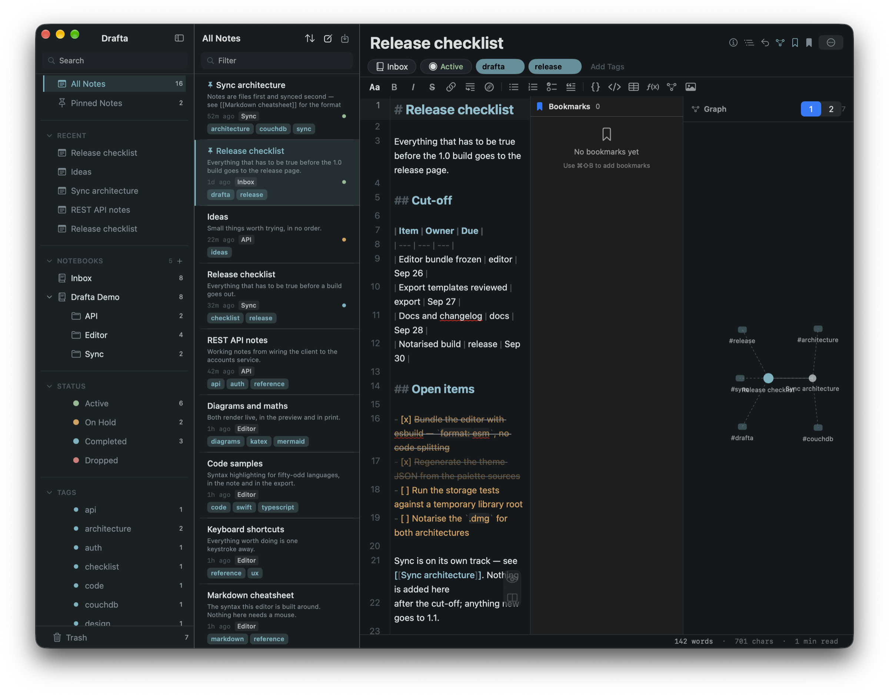

Первое решение, которое я принял в Drafta, — не заводить собственную базу данных. Заметка — это файл. Всё остальное в библиотеке — блокноты, теги, статусы, связи — строится поверх этих файлов. Об устройстве редактора я писал в статье [Редактор Drafta: Markdown, превью и split](/ru/blog/redaktor-markdown-prevyu-split).

## Один файл на заметку

Библиотека лежит на вашем Mac в папке `Library`. Внутри — папка `notes`, где каждая заметка хранится отдельным `.md`-файлом, а рядом папка `revisions` с историей правок. Файл начинается с YAML front-matter:

```yaml
---
id: <UUID заметки>
title: Release checklist
schemaVersion: 1
createdAt: "2026-09-24T19:09:00.000Z"
updatedAt: "2026-09-24T19:09:00.000Z"
notebookId: <UUID блокнота>
status: completed
extraTags: [release]
---
# Release checklist
```

Под front-matter — обычный Markdown. Такой файл читают `grep`, git и VS Code. Закрытого формата между вами и текстом нет, и смена тарифа его не заберёт.

## Блокноты

Блокноты вкладываются друг в друга без ограничения глубины. В сайдбаре они показаны деревом со счётчиками заметок. Заметку можно перетащить из списка в другой блокнот мышью. Рядом с блокнотами в сайдбаре — All Notes, закреплённые заметки, недавние и корзина.

Корзина умеет очищаться сама. В разделе General настроек можно выбрать срок: хранить всегда, 7, 30 или 90 дней.

## Теги

Теги Drafta подхватывает из текста: слово с решёткой в начале становится тегом. Тег со слешем — это путь, так строятся вложенные теги. Теги можно добавлять и вручную, кнопкой Add Tags под заголовком заметки. У каждого тега есть свой цвет: его меняют правым кликом по тегу.

## Статусы

У заметки есть статус. Их четыре:

| Статус | Для чего |
|---|---|
| Active | в работе |
| On Hold | отложено, но не забыто |
| Completed | сделано |
| Dropped | решено не делать |

Статус виден цветной точкой в списке заметок и плашкой под заголовком. В сайдбаре есть фильтр по каждому статусу со счётчиком. Побочный проект, который ждёт очереди, уходит в On Hold, а не в корзину.


*Статус Completed под заголовком заметки и зелёная точка в списке слева.*

Этот блог работает на статусах. Заметка со статусом Completed и тегом раздела сайта уходит на drafta.org сама — так опубликована и эта статья.

## Шаблоны

Любую заметку можно сохранить шаблоном: пункт Save as Template в меню заметки. Новая заметка из шаблона создаётся через окно выбора шаблона.

> [!TIP]
> ⌘N создаёт пустую заметку в текущем блокноте, ⇧⌘N открывает выбор шаблона.

## Wiki-ссылки и граф

Заметки связываются wiki-ссылками: `[[Заголовок заметки]]`. В превью ссылка становится кликабельной. Ссылка на заголовок, которого ещё нет, показывается как битая — это полезный сигнал, а не ошибка.

Панель Graph строит граф вокруг открытой заметки. Узлы — связанные заметки и теги. Глубина переключается кнопками 1 и 2: соседи заметки или ещё и соседи соседей.

## Закладки

Закладка отмечает строку внутри заметки. Панель Bookmarks собирает их в одном месте и переносит к нужной строке.



*Справа панели Bookmarks и Graph. Граф показывает теги заметки и связанную заметку Sync architecture.*

> [!TIP]
> ⇧⌘B ставит или снимает закладку на текущей строке. ⌥⌘B открывает все закладки.

## Поиск

Поле Filter над списком ищет среди заметок, а поле Search в сайдбаре сужает дерево блокнотов и список тегов. Для перехода к любой заметке есть ⌘P — нечёткий поиск по всей библиотеке. О нём и о других сочетаниях клавиш — в следующей статье.
